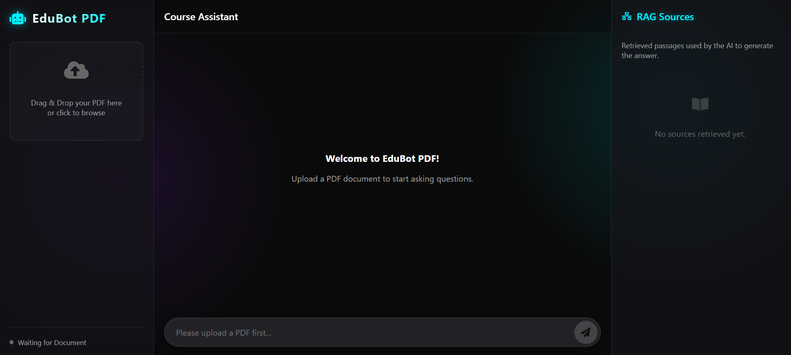
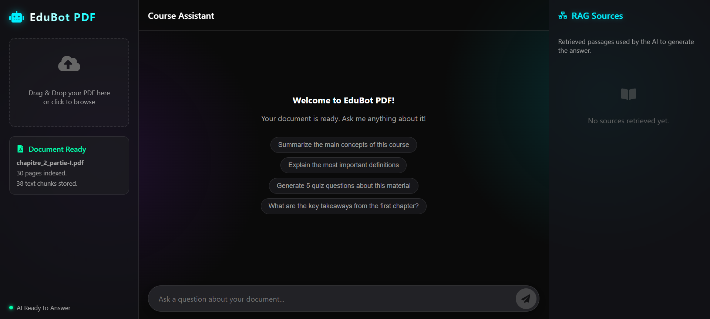
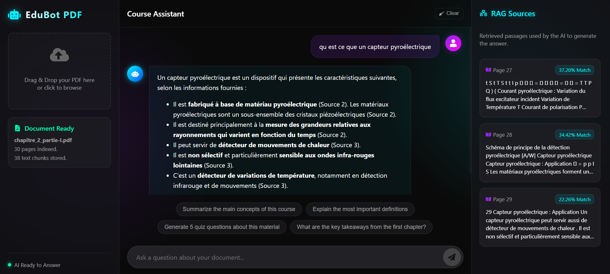

# EduBot PDF

EduBot PDF is an AI-powered educational chatbot web application that allows students to upload PDF course documents and ask intelligent questions about the uploaded course using Generative AI.

## Features
- **In-Browser RAG**: Complete Retrieval-Augmented Generation workflow running entirely in your browser without a backend server.
- **PDF Processing**: Upload PDFs to extract and chunk text automatically.
- **AI Chatbot**: Context-aware answers powered by Google Gemini 1.5 Flash.
- **Source Transparency**: View exact retrieved passages, page numbers, and similarity scores.
- **Premium UI**: Dark neon theme with glassmorphism effects, typing indicators, and smooth animations.

## Technologies Used
- React.js (Vite)
- Vanilla CSS (Custom dark neon theme)
- `pdfjs-dist` for client-side PDF parsing
- `@google/generative-ai` for Gemini API integration
- Custom lightweight TF-IDF implementation for client-side similarity search

## Installation & Setup

1. **Clone the repository** (or download the files).
2. **Install dependencies**:
   ```bash
   npm install
   ```
3. **Configure API Key**:
   Open `src/config/config.js` and replace `YOUR_API_KEY` with your actual Google Gemini API Key.
   ```javascript
   export const GEMINI_API_KEY = "AIzaSyYourActualApiKeyHere";
   ```
4. **Run the development server**:
   ```bash
   npm run dev
   ```

## Architecture Explanation

This application uses a serverless RAG (Retrieval-Augmented Generation) approach:
1. **Document Ingestion**: When a PDF is uploaded, `pdfjs-dist` extracts the text. The `chunker.js` utility splits this text into manageable overlapping chunks.
2. **Similarity Search**: When a user asks a question, the `ragEngine.js` uses a custom TF-IDF (Term Frequency-Inverse Document Frequency) algorithm with cosine similarity to find the most relevant chunks compared to the user's query.
3. **Generation**: The top retrieved chunks are injected as context into a prompt sent to the Gemini 1.5 Flash model via the official `@google/generative-ai` SDK.
4. **Transparency**: The relevant chunks are simultaneously displayed in the Right Sidebar with their similarity scores and originating page numbers.

## Screenshots







## Team
Built as a premium AI educational platform presentation.
